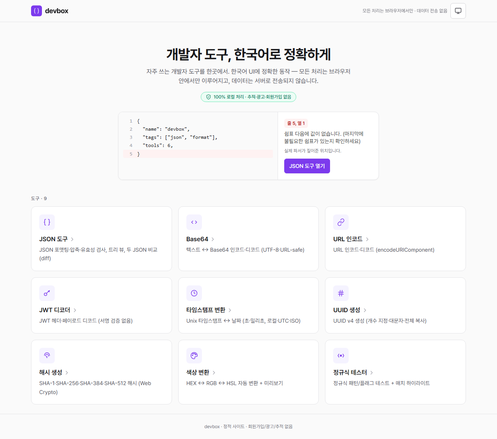

# devbox

> 브라우저에서만 동작하는 **한국어 개발자 도구 모음**. 외부 요청 0, 정확한 한국어 에러,
> 자체 호스팅 Pretendard. 9개의 자주 쓰는 도구가 같은 품질 게이트를 통과해 모여 있습니다.
>
> *Browser-only Korean developer tools — zero external requests, precise Korean error messages,
> self-hosted typography. Nine common dev utilities under one quality gate.*

**🔗 Live:** <https://hgko1207.github.io/devbox/>



---

## 왜 만들었나

한국 개발자가 "JSON 정렬"을 검색하면 영문 도구로 갑니다. it-tools, DevToys, bestdev.tools
모두 영어 우선이고 100개 이상의 도구를 늘어놓습니다. devbox는 그 반대로 갑니다 —
**한국어 UI, 검증된 정확함, 모든 처리는 브라우저에서만**.

도구 개수가 차별점이 아니라, *추가되는 모든 도구가 통과하는 품질 게이트*가 차별점입니다.

---

## 도구 (9)

### 데이터
- **[JSON 도구](https://hgko1207.github.io/devbox/json)** — 포맷·압축·유효성 검사(줄·열까지 한국어로),
  트리 뷰, 두 JSON 비교(diff). Web Worker 로 수 MB 입력도 즉시.

### 인코딩 · 디코딩
- **[Base64](https://hgko1207.github.io/devbox/base64)** — 텍스트 ↔ Base64 (UTF-8 안전, URL-safe 옵션)
- **[URL 인코드](https://hgko1207.github.io/devbox/url)** — `encodeURIComponent` / `decodeURIComponent`
- **[JWT 디코더](https://hgko1207.github.io/devbox/jwt)** — 헤더·페이로드·시간 클레임 (서명 검증은 하지 않음)

### 생성 · 계산
- **[타임스탬프 변환](https://hgko1207.github.io/devbox/timestamp)** — Unix ↔ 날짜 (초·밀리초 자동 감지)
- **[UUID 생성](https://hgko1207.github.io/devbox/uuid)** — v4 (개수·대문자 옵션)
- **[해시 생성](https://hgko1207.github.io/devbox/hash)** — SHA-1·256·384·512 (Web Crypto)

### 유틸리티
- **[색상 변환](https://hgko1207.github.io/devbox/color)** — HEX ↔ RGB ↔ HSL + 미리보기
- **[정규식 테스터](https://hgko1207.github.io/devbox/regex)** — 패턴/플래그, 매치 하이라이트, 캡처 그룹

⌘K / Ctrl+K 로 어디서든 도구 점프.

---

## 설계 결정 — 왜 이렇게 만들었나

### 1. 위치 추적 JSON 파서 (한국어 에러)

브라우저의 `JSON.parse` 는 빠르지만 에러 메시지가 모호하고 영문입니다. devbox 는 빠른 경로로
네이티브 파서를 쓰되, *실패한 경우에만* 직접 작성한 위치 추적 파서를 돌려
**줄·열·이유를 한국어로** 짚어 줍니다.

> 예: `{"a": 1,}` → "쉼표 다음에 값이 없습니다. (마지막에 불필요한 쉼표가 있는지 확인하세요)
> · 줄 1, 열 11"

위치 추적 파서는 `src/tools/json/lib/parser.ts` 에 있고, 값 생성은 의도적으로 사용하지
않습니다(에러 위치 파악 전용). 21개의 단위 테스트가 정확성을 고정합니다.

### 2. Web Worker 오프로드 — 수 MB 입력도 UI 가 멈추지 않음

JSON 도구의 포맷·압축·검증·diff 는 모두 Web Worker 에서 실행됩니다. 메인 스레드는
키 입력과 렌더링만 담당해 5MB JSON 도 즉시 반응합니다. 5MB 초과 시 자동 검사를
멈추고 "지금 검사" 버튼을 띄워 `structuredClone` 비용 폭주를 방지합니다.

워커 클라이언트(`src/tools/json/lib/workerClient.ts`)는 요청에 60초 타임아웃을 걸고
워커가 죽으면 자동 재생성합니다 — "영원히 도는 스피너" 버그를 구조적으로 차단.

### 3. 도구 레지스트리 — 한 줄로 확장

새 도구는 `meta.ts` 하나 + `src/tools/registry.ts` 의 배열에 한 줄. **홈 카드,
라우팅, ⌘K 검색 팔레트가 자동 반영**됩니다. 개발 중 `id` / `path` 중복은
런타임 가드(`validateRegistry`)가 즉시 잡습니다.

레지스트리에 카테고리만 붙이면 홈이 자동으로 그룹화합니다 — 도구가 늘어도 산만해지지 않게.

### 4. 품질 게이트 — 도구 추가 전에 통과해야 하는 6항목

모든 도구는 추가 전 이 체크리스트를 통과해야 합니다(차별화의 *실체*):

1. **한국어** — UI·에러·예제·빈 상태가 자연스러운 한국어
2. **정확성** — 빈 입력 / 거대 입력 / 잘못된 입력의 명확한 에러 / 유니코드·한글
3. **즉시성** — 작은 입력 <100ms 메인 스레드, 큰 입력은 Worker
4. **일관성** — 공유 셸(`ToolHeader`, `CodeArea`, `CopyButton`, `EncodeDecodeTool`)
5. **프라이버시** — 네트워크 요청 0 (폰트도 자체 호스팅)
6. **접근성** — 키보드만으로 핵심 동작, ARIA 탭/트리/`aria-live`, 대비 ≥4.5:1

### 5. Pretendard 자체 호스팅

시스템 폰트(`-apple-system`)는 "타이포를 포기한 신호" 입니다. devbox 는 Pretendard
variable woff2 를 **로컬에 번들**합니다 (`font-display: swap`). 외부 요청을 만들지
않으면서 한국어 타이포에 personality 를 줍니다.

### 6. CI 에 테스트 게이트

`.github/workflows/deploy.yml` 은 **test → build → deploy** 순으로 실행됩니다.
55개 단위 테스트가 통과하지 못하면 배포되지 않습니다. "검증된 정확함" 이 문서
주장이 아니라 파이프라인이 강제하는 사실입니다.

---

## 아키텍처 (한눈에)

```
src/
  components/         공유 UI (Header·Layout·CodeArea·CopyButton·ToolHeader·
                              EncodeDecodeTool·CommandPalette·HeroDemo·icons)
  lib/                theme · useDebounced · useTitle · useCopy · commandPalette
  pages/              Home · NotFound · RouteError
  fonts/              자체 호스팅 Pretendard (Vite 가 base 경로에 맞게 해시)
  tools/
    types.ts          ToolMeta
    registry.ts       도구 등록 (한 곳에 한 줄)
    json/             ★ 깊이 간판
      lib/parser.ts     네이티브 + 위치 추적 파서
      lib/diff.ts       구조적 diff
      lib/workerClient  타임아웃·재생성 보장 워커 클라이언트
      worker/           포맷·압축·검증·diff (off-main-thread)
    base64/ url/ jwt/ timestamp/ uuid/ hash/ color/ regex/
                      각 도구: lib + *.test.ts + meta + Page (lazy 청크)
```

각 도구 페이지는 **lazy 청크** 로 분리되어 홈 로딩이 가벼움(메인 ~220KB, 도구별 1–5KB).

---

## 도구 추가 방법

1. `src/tools/<도구>/` 폴더 생성
2. 페이지 컴포넌트 작성 (`<도구>Page.tsx`, default export, `ToolHeader` 사용 권장)
3. `meta.ts` 에 `ToolMeta` export — `id`, `path`, `name`, `description`, `icon`,
   `keywords`, `category`, `component: lazy(() => import('./...Page'))`
4. [`src/tools/registry.ts`](src/tools/registry.ts) 의 `tools` 배열에 import + 추가

→ 홈 카드 · 라우팅 · ⌘K 팔레트 자동 반영. 품질 게이트 6항목 통과 확인.

---

## 기술 스택

React 18 · TypeScript 5 · Vite 5 · Tailwind 3 · React Router 6 · Vitest 2 ·
Pretendard Variable (self-hosted)

---

## 개발 / 빌드 / 배포

```bash
npm install
npm run dev        # 개발 서버
npm test           # Vitest (55개)
npm run build      # 타입체크 + 빌드 (dist/)
npm run preview    # 빌드 결과 확인
```

`main` 브랜치 푸시 → GitHub Actions 가 `test → build → deploy`. base 경로는
저장소명(`/devbox/`)에 맞춰 자동. 딥링크 대응을 위해 `index.html` 을
`404.html` 로 복사합니다.

---

## 라이선스

MIT — [LICENSE](LICENSE)
